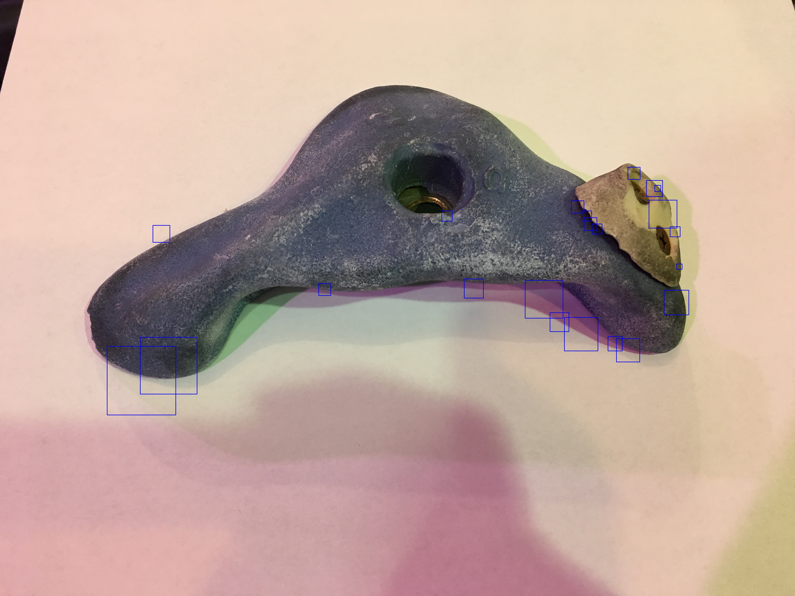

# OpenCV Hack-a-thing
Learn about and use OpenCV for custom object detection of a climbing hold.

## Setup
- ### Install with brew
  - `brew tap homebrew/science`
  - `brew install opencv3`

- ### Set paths (at least for me)
  - `export DYLD_FALLBACK_LIBRARY_PATH=/usr/local/Cellar/opencv3/3.1.0_1/lib:$DYLD_FALLBACK_LIBRARY_PATH`
  - `export PYTHONPATH=/usr/local/Cellar/opencv3/3.1.0_3/lib/python2.7/site-packages:$PYTHONPATH`
    - if this doesn't work then your opencv version might be slightly different. search around for the directory and it should work
  - `export PATH=/usr/local/Cellar/opencv3/3.1.0_3/bin:$PATH`
  - check by opening up `python` on cmd line and then trying to import – `import cv2`

## Training

- ### Gathering Data
We took 64 training images, and then resized it using this ugly bash script:

```
counter=0; name="out.jpg"; for i in $( ls ); do convert -resize 25% $i "../single_hold_training_resize/$counter$name"; let counter+=1; done;
```

- ### Image Annotation
Used [this](http://nicodjimenez.github.io/boxLabel/annotate.html) tool to help get the boudning box (pixels, top left to bottom right) of the image. This part takes a long time and is tedious!


- ### Training
  - following [this tutorial](
http://docs.opencv.org/trunk/dc/d88/tutorial_traincascade.html)
  - `opencv_createsamples --vec classifier/position_single -info info.dat -bg bg.dat`
    - use the `-img` and `-num` flag to train off one image. this is what we did when only had 7 images and had to generate training images from a single image
  - `opencv_createsamples -vec classifier/position_single -info info.dat -bg bg.dat`
  - `opencv_traincascade -data train_cascade/ -vec classifier/position_single -bg bg.dat -numPos 50 -numNeg 3`

## Results
Initial training with 7 images produced poor results. We even tested it on one of our training images 😕.



When training on 50 images, the results were much more promising! This was an unseen test image.


## Conclusion
We need more training data! We saw huge improvements going from the generated training images to actual annotated training images. Ideally we will generate training images from each actual image so instead of having 50 generated images or 50 actual images we will have 2500 images (50 of which are the original). We also only have 3 negative images – a paper we read used about 10x the number of negatives to positives, so more negatives might be a huge help here too.
